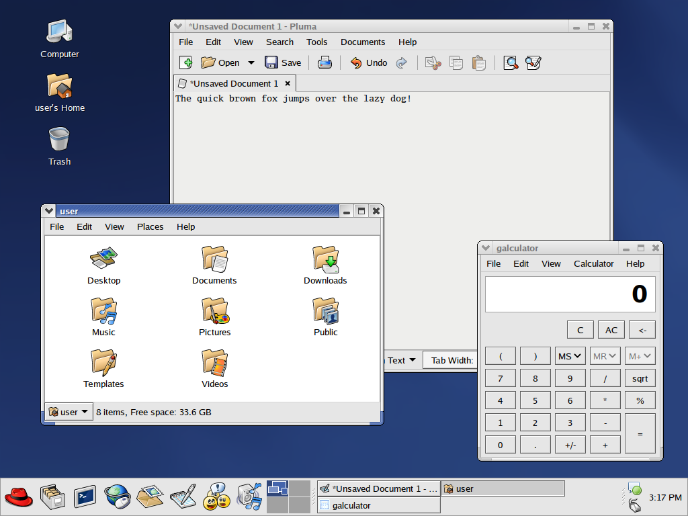
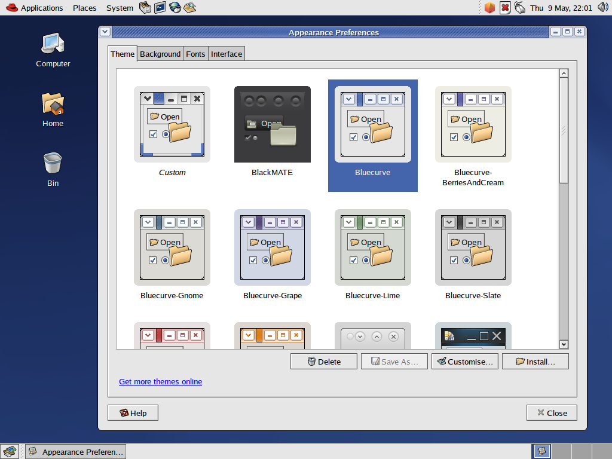

# Bluecurve GTK 3/4
Red Hat Bluecurve theme ported over to GTK 3/4. Designed for the MATE and Xfce desktop environments.

### Screenshot (Red Hat 9 style)

### Screenshot (Fedora Core 1-3 style)

### Screenshots (Widget preview, click to enlarge)
[](screenshots/Bluecurve_awf.png?raw=true)
[](screenshots/BerriesAndCream_awf.png?raw=true)
[](screenshots/Gnome_awf.png?raw=true)
[](screenshots/Grape_awf.png?raw=true)\
[](screenshots/Lime_awf.png?raw=true)
[](screenshots/Slate_awf.png?raw=true)
[](screenshots/Strawberry_awf.png?raw=true)
[](screenshots/Tangerine_awf.png?raw=true)

## Contents
- GTK 3/4 theme, forked from [Blueshell](https://github.com/Rakksor/Blueshell) and modified to make the theme better resemble the original GTK 2 theme and updated to support both GTK 3 and 4, as well as including all of the color schemes that were included with the Bluecurve theme in early versions of Fedora.
- GTK 2 engine and theme, source code is provided by Red Hat / Fedora: [bluecurve-gtk-themes-1.0.0-29.fc37.src.rpm](https://download.fedoraproject.org/pub/fedora/linux/releases/37/Everything/source/tree/Packages/b/bluecurve-gtk-themes-1.0.0-29.fc37.src.rpm)
- Original Bluecurve Metacity themes updated to resolve issues arising from using old metacity themes on newer versions of MATE.
- Original Bluecurve XFWM4 theme.
- Bluecurve icon and cursor set.
- Port of Red Hat Graphical Boot splash screen to Plymouth (includes splash screen from Fedora Core 1-3, RHEL 4, and RHEL 5). Forked from [here.](https://www.gnome-look.org/p/1656023)
- Luxi font family (fonts used originally in Red Hat 8-9 and early versions of Fedora and RHEL).
- Wallpapers that shipped with Red Hat 8-9 and early versions of Fedora, some of which were updated to widescreen by myself.

## Installation

### OpenSUSE
There is a package for OpenSUSE Tumbleweed and Leap maintained by [vyvir](https://github.com/vyvir). Follow the "Add repository and install manually" instructions [here.](https://software.opensuse.org//download.html?project=home%3Aasdhio&package=Bluecurve)

### Other distributions

#### 1. Download the theme
Either [download the latest release](https://github.com/neeeeow/Bluecurve/releases) or clone the git repository:
```bash
git clone https://github.com/neeeeow/Bluecurve.git
cd Bluecurve
```
> [!CAUTION]
> You must either download the latest release or clone the git repository. Simply downloading the repository as a .zip file breaks permissions!
#### 2. Install GTK 2 engine (required)
If on x86_64, copy `engine/x86_64/libbluecurve.so` to `/usr/lib64/gtk-2.0/2.10.0/engines`
```bash
sudo cp engine/x86_64/libbluecurve.so /usr/lib64/gtk-2.0/2.10.0/engines
```
If on i686, copy `engine/i686/libbluecurve.so` to `/usr/lib/gtk-2.0/2.10.0/engines`
```bash
sudo cp engine/i686/libbluecurve.so /usr/lib/gtk-2.0/2.10.0/engines
```
> [!TIP]
> If unsure on whether or not your Linux installation is 32-bit (i686) or 64-bit (x86_64), run the command `uname -a`. You are most likely using a x86_64 installation. If you are using an architecture other than i686 or x86_64, you will have to compile the GTK 2 engine yourself.

#### 3. Install icon and cursor set
Copy the contents of the `icons` folder to `/usr/share/icons`
```bash
sudo cp -r icons/* /usr/share/icons
```
#### 4. Install theme
Copy the contents of the `themes` folder to `/usr/share/themes`
```bash
sudo cp -r themes/* /usr/share/themes
```
#### (Optional) 5. Install Plymouth themes
Included in the `plymouth` folder are Plymouth ports of the RHGB boot screen used in Fedora Core 1-3 and RHEL 4/5. Themes `rhgb-fc1`, `rhgb-rhel4` and `rhgb-centos4` require the font "Luxi Sans" to be installed (if not installed see step 6 below).

| Folder name  | Theme |
| ------------- | ------------- |
| rhgb-fc1  | Fedora Core 1-3 Plymouth theme |
| rhgb-rhel4  | RHEL 4 Plymouth theme |
| rhgb-centos4  | CentOS 4 Plymouth theme |
| rhgb-rhel5  | RHEL 5 Plymouth theme |

To install the theme first copy the desired theme (or all of them!) to `/usr/share/plymouth/themes`. Using `rhgb-fc1` as an example:
```bash
sudo cp -r plymouth/rhgb-fc1 /usr/share/plymouth/themes
```
Then simply enable the Plymouth theme
```bash
sudo plymouth-set-default-theme -R rhgb-fc1
```
#### (Optional) 6. Install Luxi fonts
> [!WARNING]
> Only do this step if your distribution doesn't include the Luxi font family.

First create the directory `/usr/local/share/fonts` if it doesn't exist.
```bash
sudo mkdir /usr/local/share/fonts
```
Next, copy the fonts to the directory.
```bash
sudo cp fonts/*.ttf /usr/local/share/fonts
```

## Hints
### Use Red Hat icon in MATE menu bar
Simply execute the following command:
```bash
gsettings set org.mate.panel.menubar icon-name 'redhat-icon-panel-menu'
```
