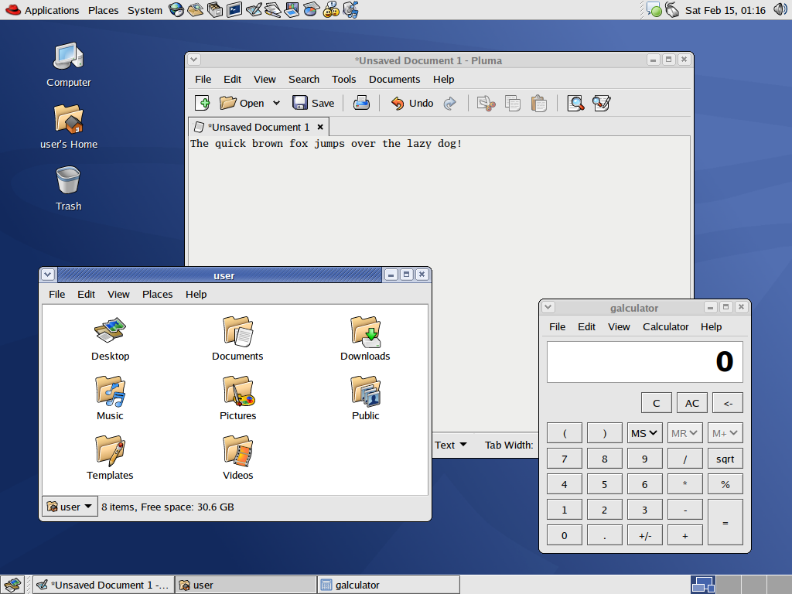

# Bluecurve GTK 3/4
Red Hat Bluecurve theme ported over to GTK 3/4. Designed for the MATE and Xfce desktop environments.

### Screenshot

### Screenshots (Widget preview, click to enlarge)
[](screenshots/Bluecurve_awf.png?raw=true)
[](screenshots/BerriesAndCream_awf.png?raw=true)
[](screenshots/Gnome_awf.png?raw=true)
[](screenshots/Grape_awf.png?raw=true)\
[](screenshots/Lime_awf.png?raw=true)
[](screenshots/Slate_awf.png?raw=true)
[](screenshots/Strawberry_awf.png?raw=true)
[](screenshots/Tangerine_awf.png?raw=true)

## Contents
- GTK 3/4 theme, forked from [Blueshell](https://github.com/Rakksor/Blueshell) and significantly rewritten/extended to make the theme better resemble the original GTK 2 theme and updated to support both GTK 3 and 4, as well as including all of the color schemes that were included with the Bluecurve theme in early versions of Fedora.
- GTK 2 engine and theme.
- Original Bluecurve Metacity themes updated to resolve issues arising from using old metacity themes on newer versions of MATE.
- Original Bluecurve XFWM4 theme, updated to support the additional color schemes.
- Bluecurve icon and cursor set.
- Luxi font family (fonts used originally in Red Hat 8-9 and early versions of Fedora and RHEL).
- Wallpapers that shipped with Red Hat 8-9 and early versions of Fedora, some of which were updated to widescreen by myself.

## Automatic installation (reccomended)

### 1. Download the theme
Either [download the latest release](https://github.com/neeeeow/Bluecurve/releases) or clone the git repository:
```bash
git clone https://github.com/neeeeow/Bluecurve.git
cd Bluecurve
```
> [!CAUTION]
> You must either download the latest release or clone the git repository. Simply downloading the repository as a .zip file breaks permissions!

### 2. Run the install script
```bash
./install.sh
```
## Manual installation
### 1. Download the theme
Either [download the latest release](https://github.com/neeeeow/Bluecurve/releases) or clone the git repository:
```bash
git clone https://github.com/neeeeow/Bluecurve.git
cd Bluecurve
```
### 2. Compile GTK 2 engine
First ensure that you have the following installed on your system:
- Cmake
- gcc
- GTK 2 development libraries

Then navigate to the GTK 2 engine source code directory:
```bash
cd engine/src
```
Then create the `build` folder
```bash
mkdir build && cd build
```
Next run `cmake`
```bash
cmake ..
```
Finally, compile and install the GTK 2 engine (the engine is installed to `~/.gtk-2.0/engines`) and return to the repository's root directory:
```bash
make && make install && cd ../../../
```

### 3. Install icon and cursor set
Copy the contents of the `icons` folder to `~/.icons`
```bash
cp -r icons/* ~/.icons
```
### 4. Install GTK theme
Copy the contents of the `themes` folder to `~/.themes`
```bash
cp -r themes/* ~/.themes
```

### (Optional) 5. Install Luxi fonts
> [!WARNING]
> Only do this step if your distribution doesn't include the Luxi font family.

First create the directory `~/.local/share/fonts` if it doesn't exist:
```bash
mkdir ~/.local/share/fonts
```
Next, copy the fonts to the directory:
```bash
cp fonts/*.ttf ~/.local/share/fonts
```

## Hints
### Use Red Hat icon in MATE menu bar
Simply execute the following command:
```bash
gsettings set org.mate.panel.menubar icon-name 'redhat-icon-panel-menu'
```

### Compile & install GTK 2 engine system-wide
If you wish to compile & install the GTK 2 engine system-wide, simply enable the `INSTALL_SYSTEM_WIDE` flag when compiling the engine.

**Instructions:**
```bash
cd engine/src
mkdir build && cd build
cmake -DINSTALL_SYSTEM_WIDE=ON ..
make
sudo make install
```

## Contributing
Contributors are more than welcome! If you would like to contribute, first read the [contributing guidelines](https://github.com/neeeeow/Bluecurve/blob/master/CONTRIBUTING.md).
