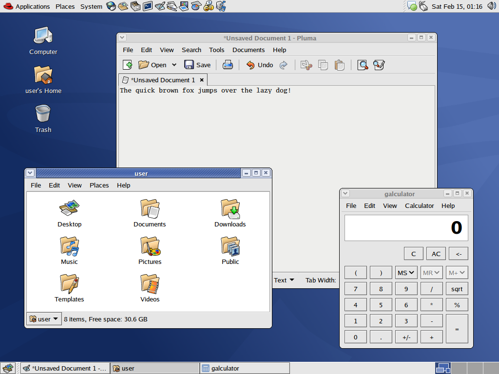

<p align="center">
  
</p>

# Bluecurve GTK 3/4
Red Hat Bluecurve theme ported over to GTK 3/4. Designed for the MATE, Xfce and KDE desktop environments.

### Screenshot

### Screenshots (Widget preview, click to enlarge)
[](screenshots/Bluecurve_awf.png?raw=true)
[](screenshots/BerriesAndCream_awf.png?raw=true)
[](screenshots/Gnome_awf.png?raw=true)
[](screenshots/Grape_awf.png?raw=true)\
[](screenshots/Lime_awf.png?raw=true)
[](screenshots/Slate_awf.png?raw=true)
[](screenshots/Strawberry_awf.png?raw=true)
[](screenshots/Tangerine_awf.png?raw=true)

## Contents
- GTK 3/4 theme, with support for dynamic color theming.
- GTK 2 engine and theme.
- Original Bluecurve Metacity themes, updated to resolve issues arising from using old metacity themes on newer versions of MATE.
- Original Bluecurve XFWM4 theme, updated to support additional color schemes.
- Bluecurve icons in scalable SVG format, taken from the original Adobe Illustrator source.
- Bluecurve cursors.
- Luxi font family (fonts used originally in Red Hat 8-9 and early versions of Fedora and RHEL).
- Wallpapers that shipped with Red Hat 8-9 and early versions of Fedora, some of which were updated to widescreen by myself.

## Installation

### Requirements
- GTK 2/3 development libraries.
- CMake.
- Python 3.

### 1. Download the theme
Either [download the latest release](https://github.com/neeeeow/Bluecurve/releases) or clone the git repository:
```bash
git clone https://github.com/neeeeow/Bluecurve.git
cd Bluecurve
```
> [!CAUTION]
> You must either download the latest release or clone the git repository. Simply downloading the repository as a .zip file breaks permissions!

### 2. Compile & install

> [!IMPORTANT]
> GTK 2 is no longer included on some distributions, including RHEL 10 and the upcoming Debian 14. If your distribution does not include GTK 2, execute `cmake .. DCOMPILE_GTK2_ENGINE=OFF` instead of `cmake ..` to disable GTK 2 engine compilation.

```
mkdir build && cd build
cmake ..
make
sudo make install
```

### (Optional) 3. Install Luxi fonts
> [!WARNING]
> Only do this step if your distribution doesn't include the Luxi font family.

First create the directory `~/.local/share/fonts` if it doesn't exist:
```bash
mkdir ~/.local/share/fonts
```
Next, copy the fonts to the directory:
```bash
cp fonts/*.ttf ~/.local/share/fonts
```
### (Optional) 4. Install the Qt 5/6 theme
See [neeeeow/Bluecurve-Qt](https://github.com/neeeeow/Bluecurve-Qt).

### (Optional) 5. Install the KDE 6 theme
See [neeeeow/Bluecurve-KDE](https://github.com/neeeeow/Bluecurve-KDE).

## Hints
### Use Red Hat icon in MATE menu bar
Simply execute the following command:
```bash
gsettings set org.mate.panel.menubar icon-name 'redhat-icon-panel-menu'
```

## Contributing
Contributors are more than welcome! If you would like to contribute, first read the [contributing guidelines](https://github.com/neeeeow/Bluecurve/blob/master/CONTRIBUTING.md).
